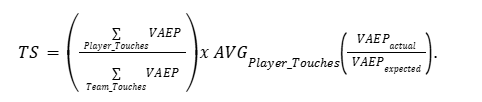
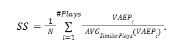
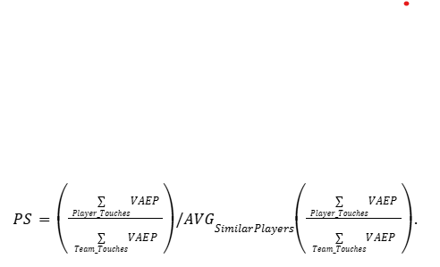
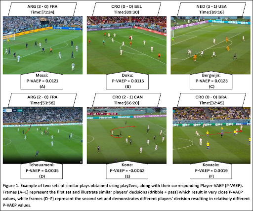

# RIVAL Score: Benchmarking Player Decision Evaluation in Soccer Using Relative Individual Value Assessment

## Introduction
The evaluation of player decision-making in soccer presents a significant challenge due to the inherently dynamic and unique context of each match. Comparing the decision value of players across matches, teams, and tactical settings is non-trivial, as the circumstances surrounding every decision vary considerably.  

This work introduces **RIVAL (Relative Individual Value Assessment)**, a framework designed to benchmark the quality of player decisions across matches, teams, and comparable players. The framework provides a systematic and objective methodology for quantifying player decision value, facilitating meaningful cross-player and cross-team comparisons.

---

## Methodology
The proposed framework incorporates a three-component metric:

1. **Tactical Score (TS):**  
   Evaluates the contribution of a player’s action to team value and its alignment with tactical objectives.  

2. **Similar Plays Score (SS):**  
   Benchmarks the player’s decision against corresponding decisions made by other players in analogous scenarios across matches.  

3. **Peers Score (PS):**  
   Assesses the quality of decisions relative to similar players identified by playing style or positional role.

---

### A. Tactical Score (TS)
The Tactical Score measures the degree to which a player’s contributions align with and enhance their team’s tactical execution. It is defined as:

  

- The **first component** quantifies the player’s share of contribution to the team’s overall value.  
- The **second component** evaluates the added tactical value by comparing the expected decision, derived from team style, with the actual decision observed.  

**Modeling Approach:**  
A **Boformer model**  is trained on **63 matches** from the FIFA World Cup 2022 public dataset (tracking and event data). It is subsequently fine-tuned on **6 matches** of the player’s team (assuming progression to the final). The trained model generates the expected decisions against which player actions are benchmarked.

---

### B. Similar Plays Score (SS)
The Similar Plays Score evaluates decision quality by analyzing analogous game situations. A **play2vec model**  is trained on the same dataset to embed plays and retrieve nearest-neighbor plays for comparison.  

The score is calculated as:  

   

  
   

Where each ratio compares the player’s VAEP in a given play to the average VAEP of corresponding players in the retrieved similar plays.

---

### C. Peers Score (PS)
The Peers Score benchmarks a player’s decision quality against comparable players identified via embeddings from the Boformer model.  

It is defined as:  
   

  
   

This formulation captures whether the player performs above or below the decision-making benchmark set by peers with a similar role or style.

---

## Results
- **Figure 1** illustrates examples of similar plays identified for a given situation, highlighting variation in player decisions and their resulting values. 
 

  
   

- **Table 1** presents RIVAL-derived scores for all players in the **2022 FIFA World Cup Final**.  
# Player Scores

| # | Player              | Tactical Score (TS) | Similar Plays Score (SS) | Peers Score (PS) | Public Rating (Final) | Public Rating (World Cup) |
|---|---------------------|---------------------|---------------------------|------------------|-----------------------|---------------------------|
| **Argentina** |||||||
| 1 | Lionel Messi        | 0.253               | 4.33                      | 2.30             | 9.2                   | 8.49                      |
| 2 | Ángel Di María      | 0.227               | 3.96                      | 1.85             | 8.1                   | 7.68                      |
| 3 | Rodrigo De Paul     | 0.116               | 4.20                      | 1.42             | 6.4                   | 7.25                      |
| 4 | Enzo Fernández      | 0.100               | 3.65                      | 1.05             | 7.1                   | 7.50                      |
| 5 | Alexis Mac Allister | 0.075               | 1.74                      | 0.79             | 7.4                   | 7.62                      |
| 6 | Nicolás Otamendi    | 0.067               | 1.68                      | 0.75             | 6.1                   | 7.12                      |
| 7 | C. Romero           | 0.063               | 2.30                      | 0.87             | 6.4                   | 6.86                      |
| 8 | Nicolás Tagliafico  | 0.050               | 1.73                      | 0.54             | 6.8                   | 6.76                      |
| **France** |||||||
| 1 | Kylian Mbappé       | 0.434               | 1.68                      | 4.89             | 8.5                   | 8.31                      |
| 2 | Olivier Giroud      | 0.188               | 1.29                      | 2.06             | 6.7                   | 7.47                      |
| 3 | Theo Hernandez      | 0.147               | 0.90                      | 1.47             | 6.8                   | 7.74                      |
| 4 | Antoine Griezmann   | 0.135               | 1.11                      | 1.28             | 7.1                   | 7.82                      |
| 5 | Dayot Upamecano     | 0.065               | 1.16                      | 1.29             | 6.8                   | 7.23                      |
| 6 | Kingsley Coman      | 0.063               | 2.43                      | 0.64             | 6.6                   | 6.34                      |
| 7 | Jules Koundé        | 0.054               | 1.23                      | 0.40             | 6.3                   | 7.44                      |
| 8 | A. Tchouaméni       | 0.050               | 0.78                      | 0.52             | 6.4                   | 7.61                      |

When compared with public SofaScore ratings:  
- The Tactical Score achieved an average coefficient of determination (**R² = 0.85**).  
- The correlation with player rankings, measured using Spearman’s rank correlation, was **0.54**.  

These results indicate that RIVAL provides a reliable and interpretable measure of decision quality.

---

## Conclusion
The **RIVAL framework** establishes an objective methodology for benchmarking player decisions in soccer. By jointly evaluating decisions against:  

- Tactical alignment,  
- Comparable in-game scenarios, and  
- Similar peer players,  

RIVAL delivers a robust, data-driven assessment of decision effectiveness. This framework has practical applications in **player scouting, recruitment, and evaluation**, enabling clubs to identify individuals whose decision-making style optimally complements their tactical system.  

---

## References

  - Decroos, T. (2019). Actions Speak Louder Than Goals: Valuing Player Actions in Soccer.*
  (<a href="https://doi.org/10.1145/3292500.3330758">click here</a>)

  - Alcorn, M. (2021). *Boformer: Transformer-Based Models for Tactical Decision Prediction in Soccer.*  
  (<a href="https://doi.org/10.48550/arXiv.2104.11980">click here</a>)

 

  - Wang, Z. (2019). *play2vec: Learning Representations of Soccer Plays for Retrieval and Analysis.*  
  (<a href="https://doi.org/10.1145/3292500.3330927">click here</a>)

 

  - FIFA World Cup 2022 public dataset (tracking and event data).*
  (<a href="https://drive.google.com/drive/folders/1_a_q1e9CXeEPJ3GdCv_3-rNO3gPqacfa">click here</a>)

 

  - SofaScore public ratings.*
  (<a href="https://www.sofascore.com/">click here</a>)

