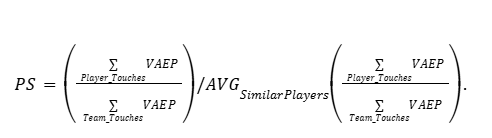

# RIVAL Score: Benchmarking Player Decision Evaluation in Soccer Using Relative Individual Value Assessment

## Introduction
The evaluation of player decision-making in soccer presents a significant challenge due to the inherently dynamic and unique context of each match. Comparing the decision value of players across matches, teams, and tactical settings is non-trivial, as the circumstances surrounding every decision vary considerably.  

This work introduces **RIVAL (Relative Individual Value Assessment)**, a framework designed to benchmark the quality of player decisions across matches, teams, and comparable players. The framework provides a systematic and objective methodology for quantifying player decision value, facilitating meaningful cross-player and cross-team comparisons.

---

## Methodology
The proposed framework incorporates a three-component metric:

1. **Tactical Score (TS):**  
   Evaluates the contribution of a player’s action to team value and its alignment with tactical objectives.  

2. **Similar Plays Score (SS):**  
   Benchmarks the player’s decision against corresponding decisions made by other players in analogous scenarios across matches.  

3. **Peers Score (PS):**  
   Assesses the quality of decisions relative to similar players identified by playing style or positional role.

---

### A. Tactical Score (TS)
The Tactical Score measures the degree to which a player’s contributions align with and enhance their team’s tactical execution. It is defined as:

- The **first component** quantifies the player’s share of contribution to the team’s overall value.  
- The **second component** evaluates the added tactical value by comparing the expected decision, derived from team style, with the actual decision observed.  

**Modeling Approach:**  
A **Boformer model** ([Alcorn, 2021]) is trained on **63 matches** from the FIFA World Cup 2022 public dataset (tracking and event data). It is subsequently fine-tuned on **6 matches** of the player’s team (assuming progression to the final). The trained model generates the expected decisions against which player actions are benchmarked.

---

### B. Similar Plays Score (SS)
The Similar Plays Score evaluates decision quality by analyzing analogous game situations. A **play2vec model** ([Wang, 2019]) is trained on the same dataset to embed plays and retrieve nearest-neighbor plays for comparison.  

The score is calculated as:  

   

Where each ratio compares the player’s VAEP in a given play to the average VAEP of corresponding players in the retrieved similar plays.

---

### C. Peers Score (PS)
The Peers Score benchmarks a player’s decision quality against comparable players identified via embeddings from the Boformer model.  

It is defined as:  

   

This formulation captures whether the player performs above or below the decision-making benchmark set by peers with a similar role or style.

---

## Results
- **Figure 1** illustrates examples of similar plays identified for a given situation, highlighting variation in player decisions and their resulting values.  
- **Table 1** presents RIVAL-derived scores for all players in the **2022 FIFA World Cup Final**.  

When compared with public SofaScore ratings:  
- The Tactical Score achieved an average coefficient of determination (**R² = 0.85**).  
- The correlation with player rankings, measured using Spearman’s rank correlation, was **0.54**.  

These results indicate that RIVAL provides a reliable and interpretable measure of decision quality.

---

## Conclusion
The **RIVAL framework** establishes an objective methodology for benchmarking player decisions in soccer. By jointly evaluating decisions against:  

- Tactical alignment,  
- Comparable in-game scenarios, and  
- Similar peer players,  

RIVAL delivers a robust, data-driven assessment of decision effectiveness. This framework has practical applications in **player scouting, recruitment, and evaluation**, enabling clubs to identify individuals whose decision-making style optimally complements their tactical system.  

---

## References
- Decroos, T. (2019). *Actions Speak Louder Than Goals: Valuing Player Actions in Soccer.*  
- Alcorn, M. (2021). *Boformer: Transformer-Based Models for Tactical Decision Prediction in Soccer.*  
- Wang, Z. (2019). *play2vec: Learning Representations of Soccer Plays for Retrieval and Analysis.*  
